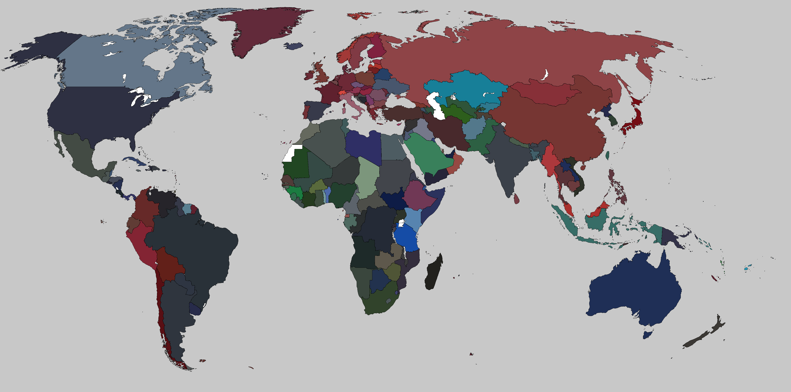

# World Passport Color

The map shows every country in the color of its real passport.

The map has been colored by a python script averaging the real image of every
country's passport.

**NOTE**: with a few modifications the code can be used to create python scripts 
coloring the world map by simply associating a color with the country code.

## Meta

More to read ([*](./NOTETOSELF.md)):

 - http://gnuplot.sourceforge.net/demo_svg_5.2/pointsize.html
 - https://scipy-cookbook.readthedocs.io/items/Matplotlib_Maps.html
 - https://plotly.com/python/choropleth-maps/
 - https://towardsdatascience.com/a-complete-guide-to-an-interactive-geographical-map-using-python-f4c5197e23e0
